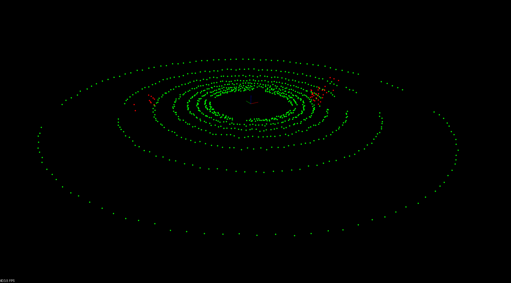

# Sensor Fusion Self-Driving Car Course
## Lidar Obstacle Detection


## Kd Tree


## Ransac


## Run
```bash
sudo apt install libpcl-dev
cd ~
git clone https://github.com/jjw-DL/Lidar_Obstacle_Detection.git
cd Lidar_Obstacle_Detection
mkdir build && cd build
cmake ..
make
./environment
```

## Original_github
https://github.com/udacity/SFND_Lidar_Obstacle_Detection.git
